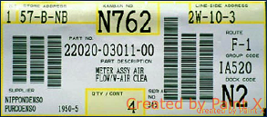
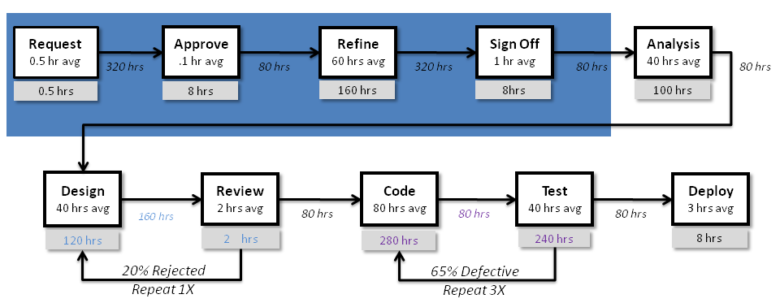
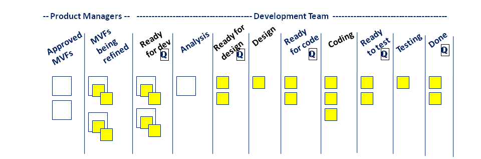
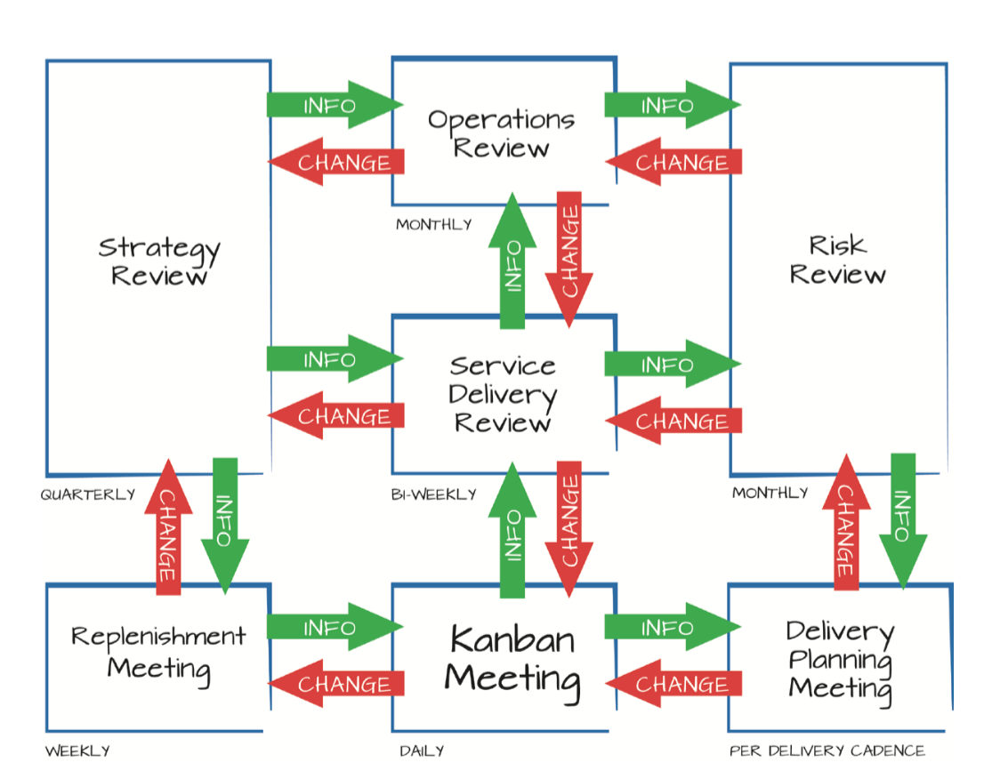

# KANBAN

In this section, we will address some good practices related to KANBAN.

## Index
* [KANBAN definition](#definition-of-kanban)
* [Core Values](#core-values)
* [Core Practices](#core-practices)
* [Value Stream Mapping](#value-stream-mapping)
* [KANBAN Board](#kanban-board)
* [Kanban meetings](#kanban-meetings)
* [Iterations](#iterations)
* [Planning](#planning)
* [Optimization and improvement](#optimization-and-improvement)
* [Good practices for KANBAN teams](#good-habits-for-kanban-teams)
* [References](#references)

### KANBAN definition

There are differences between **k**anban system and **K**anban method.

#### Wikipedia's definition for **KANBAN SYSTEM** is:

> KANBAN is a scheduling system for lean manufacturing and just-in-time manufacturing (JIT). Kanban is an inventory-control system to control the supply chain. Kanban became an effective tool to support running a production system as a whole, and an excellent way to promote improvement.

Sakichi Toyoda, Kiichiro Toyota and the engineer Taiichi Ohno created it between 1946 and 1975.

The KANBAN word is a japanese word where **KAN** means **'visual'** and **BAN** means **'card'**. Toyota's Production System is based on cards used for production system control. Those cards contain all information needed to make the required pieces at a given time.

 
**Kanban Card in 1950s**

 
**Kanban Card now**

#### Wikipedia's definition for **KANBAN METHOD** is:

> KANBAN is a method for managing knowledge work with an emphasis on just-in-time delivery while not overloading the team members. In this approach, the process, from definition of a task to its delivery to the customer, is displayed for participants to see. Team members pull work from a queue.

It appears in **2002** by **David J. Anderson**, who begins to propose a different form in management of software development projects.

> KANBAN in the context of software development can mean a visual process-management system that tells what to produce, when to produce it, and how much to produce - inspired by the Toyota Production System and by Lean manufacturing.

It starts from **you are doing right now**, It makes **work visible**, It delivers **knowledge work** and It **uses kanban system** to do it.

### Core values

There are **nine** Core Values on KANBAN Method:

 1. **Transparency**: To share information openly improve business flow.
 2. **Balance**: To understand that differents aspects, points of view and capabilities must be balanced to reach the success.
 3. **Collaboration**: To make team work together and coordinated.
 4. **Customer Focus**: To know the project target and always keep the team thinking in its achievement.
 5. **Flow**: Work increment and continuous improvement.
 6. **Leadership**: To inspire to other team members to act.
 7. **Understanding**: Individual and organizational auto-knowledgement to go forward.
 8. **Agreement**: Commitment to go forward to the target but we always have to respect differences and opinions.
 9. **Respect**: To the process, to people, to the work, ... It's the base on which we must to build the rest of the values.

### Core Practices

There are **six** Core Practices on KANBAN Method:

 1. **Visualize the work**: Getting all work visible allows a better management and identification of queues and bottlenecks (or personal procrastination on specific tasks).
 2. **Limit Work In Progress (WIP)**: Increase focus and set priorities, manage overload (keeping an adequate margin). A proper load of Work In Progress will keep the team in the flow instead of facing anxiety or boredom.
 3. **Manage flow**: The flow of work items through each state in the workflow should be monitored and reported - often referred to as Measuring Flow.
 4. **Make policies visible and explicit**: Every team member must know the defined policies for the process.
 5. **Feedback loops**: Implement at a service delivery level in organizations, Kanban, uses four specific practices for feedback: the standup meeting; the service delivery review; the operations review; and the risk review. The purpose of feedback loops is to be able to compare expected outcomes with actual outcomes and make adjustments
 6. **Improve and evolve the workflow**: Try to constantly analyze the flow to increase productivity and improve the flow's smoothness.

### Value Stream Mapping

A Value Stream Map (VSM) shows your workflow as well as the time it takes to do the work. Here is a ximpel example:

 
**Value Stream Mapping**

### KANBAN Board

The KANBAN board is the main tool for following the Core Practices of KANBAN. It reflects the status for a task or story's workflow, from the moment of its creation until it is completed and delivered.

It only convers part of the VSM. Usually only from input to development through deployment. It does not cover the first part of the value stream.

Compare the **Kanban board** below with the **value stream map** above.

 
**Kanban Board Example**

A KANBAN board can be a physical board or a collaborative digital board. But in any of them, the good practices to follow are the same:
* **Keep the KANBAN board updated**: The board must represent the actual state of the work.
* **Keep the acquired policies visible**: The board is good place to show everyone what the committed policies are.
* **Keep the WIP limit visible**: Each column should reflect its WIP limit.
* **Begin with a simple board**: At first project's stages it is recommended to use a board as simple as possible. For example:

> | To Do | In Process | Done |
> |:-----:|:----------:|:----:|
> |       |            |      | |

Once you know your workflow better, you can add new columns representing a more accurate workflow. For example:

> | To Do | Plan | Develop | Test | Deploy | Done|
> |:-----:|:----:|:-------:|:----:|:------:|:---:|
> |       |      | In progress / Done | | | | |

* **Bottlenecks**: The board can also be useful to detect bottlenecks: when a task cannot advance in the workflow, a potential bottleneck can be the reason. In that case, it is important to find improvements for the workflow that could clear the bottlenecks.

* **Ready Indicators**: In addition to the visual workflow you can use Indicators to visualize when a task can change to the next state on the workflow.

* **Blocked Indicators**: These indicators can help to visualize blocked tasks, than can not be completed or advance through the workflow.

* **Classes of service**: Depending on the tasks' nature, different class of service can be defined. It is completely different to resolve a bug than building a new functionality. Each team must define its own classes of service, but a generic guideline can be followed : 
  * **Expedite**: Very important task that can not wait to be done.
  * **Fixed** delivery date: A task that must be delivered at a fixed time.
  * **Standard** class: A normal task which describes functionality and can be estimated.
  * **Intangible** class: Tasks that can not be estimated.

* **Policies**: The KANBAN board is a good place to make your policies explicit. You can consider general policies or specific ones for every class of service.

### Kanban meetings

People often think that Kanban have less meetings or formalities that other agile methodologies, but really, Kanban have **seven** official meetings in total. Although in each case, teams use only the ones they need. Most of them are auto explicatives:

 1. **Standup Meeting**: It's the equivalent to the Scrum Daily meeting. Its objective is to keep the team coordinated and that all people know what are doing each one. In this way, the information can flow. It answer to the questions: "Who is doing that task", "Who needs some help", "Tasks blocked", etc...
 2. **Replenishment Meeting**: It's the equivalent to the Scrum Planning meeting. Its objective is to decide what tasks will be in the kanban board. It have some differences between Scrum, because for example, stakeholders can attend to this meeting.
 3. **Operations Review**: It isn't have equivalent in Scrum, It's specific in Kanban. This is a look of how is the collaboration inside and between teams or departments. The target is that the different tribes are coordinated and synchronized.
 4. **Delivery Planning Meeting**: It analyze what is ready to deliver with the approval of the people that are going to receive it. It takes into account risks during the development process, for example if priority of some tasks in progress have been changed or if some extra information is needed to ensure a smooth transfer of WIP. In summary, teams decide what to deliver and when.
 5. **Service Delivery Review**: This meeting is mainly focused in customer satisfaction. We must explore needs to know if the users and customers are going to be satisfied with the development team processes, efficiency and communication. The target is to improve the confidence between teams and customers, through the transparency.
 6. **Risk Review**: It examines what possibles risks the teams can have in a near future, failures that the team have had previously and tasks that are blocked or into re-working process right now. In summary, the teams contributes to identify risks through a comprehensive planning based on experience.
 7. **Strategy Review**: The main focus of this meeting is the marketing team. It analyze if the goals are optimized and updated to meet market trends and needs. We have to question us if there are mismatches between that we are doing right now and the new market demands. Usually, the results of this meeting are changes in the guidelines or KPIs if needed.

 
**Kanban Cadences Diagram**

### Iterations

* In KANBAN **there is no iterations**, as there is only a single iteration, which is continuous. Therefore, backlog is fed as new tasks are needed.
* Finished work increment is planned and completed functionality is released frequently.
* Some iteration's common metrics, like burndown charts, are not available in KANBAN. Instead, there are other ones, like **cycle time**

### Planning

* KANBAN does not include a planning meeting.
* Product's backlog must be ordered by priority and value.
* When a member of the group is idle, he should begin with the next Backlog's item.
* The backlog is continuously fed as new task are needed.
* Tasks' estimation can be performed when the task is placed in the board.

### Optimization and improvement

* KANBAN does not include a retrospective meeting.
* Instead, improvement and optimization is done whenever a team member detects a problem and an opportunity of improving the workflow.

### Good practices for KANBAN teams

* KANBAN is recommended for Cross Teams
* It is strongly recommended that KANBAN teams work as near as possible in order to enhance member communication.
* Although KANBAN does not enforce any roles, it is recommended to have, at least:
  * A business or Product Owner
  * A KANBAN Coach or Agile Coach
* A KANBAN team should strictly focus on the work in progress at any given time
*  The team's goal is to reduce the amount of time an issue takes to move through the entire process

### References
* [Wikipedia](http://tinyurl.com/4nrxsk6)
* [Kanban - David J. Anderson](http://www.amazon.es/dp/0984521402)
* [Agile Coaching - Rachel Davies](http://www.amazon.es/dp/1934356433)
* [The seven Kanban Cadences](http://blog.kanbanery.com/the-seven-kanban-cadences)

___

[BEEVA](https://www.beeva.com) | Technology and innovative solutions for companies
