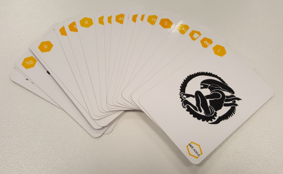

# SCRUM

In this section, we will address some good practices related to Scrum.

## Index
* [1. Scrum definition](#definition-of-scrum)
* [2. Good practices for Sprints and Daily meeting](#good-practices-for-sprints-and-daily-meeting)
* [3. Good practices for Scrum teams](#good-practices-for-Srum-teams)
* [4. Planing poker](#planing-poker)
* [5. References](#references)

## 1. Scrum definition

Scrum Guide's definition for Scrum is:
> Scrum is a **framework** for developing and sustaining complex products.

Scrum is based in **empirical process control**, that is, taking decisions based in experience.
The tree pillars in empirical process control are: inspection, adaptation and transparency.

The Scrum Team consists of **Scrum Master, Product Owner and the Development Team**.

It is a common practice to implement scrum but with little modifications to adapt it to each team or company's working methods. This is a mistake, being able to lose the true value of scrum. But there are other methodologies like [Scrumban](https://en.wikipedia.org/wiki/Scrumban) that take things from kanban and scrum. But it's not really scrum.

## 2. Good practices for Sprints and Daily meeting.

### Sprints

* During the first sprint, the developer team have to create the first functional and releasable part of software.

* The maximum duration of a sprint is **1 month**, but usually are shorter.

* The time-box for sprint planning meeting is 8 hours for 1 mount sprint or less for shorter sprints.

* If during a sprint the development team knows that they will not be able to complete the work, they should meet with the product owner to re-evaluate the scope.

* Sprint backlog may change during the sprint, either because the business objectives have changed or the goals are obsolete.

### Daily Meeting

* The Daily meeting time-box is **15 minutes**.

* In daily meeting, It should be avoided to enter into discussions and simply tell what has been done on the last day, what is going to be done today and the problems that have arisen.

* Each developer team member must answer the three questions (yesterday, today and problems) keeping the daily meeting agile.

## 3. Good practices for Scrum teams

* The perfect number for **development team** members is more than 3 and less than 9.

* The **developer team** have to be able to explain to product owner the real progress and alternatives about the development, because normally the product owner is not a technical profile and needs support.

* Sprint backlog items are responsibility of ALL **developer team**, even though each one may be done by an individual.

* In Scrum there is no **manager** role as such. But the head of the development team must help to the scrum master with the organization and to the product owner with maximizing the value of the developments.

* The **development team** should not change members often because it implies a loss of productivity.

* It is the responsibility of the **product owner** to deal with other managers who wish to modify the scope of an sprint or add items in sprint backlog.

* It is the responsibility of the **scrum master** to implement the scrum methodology and ensure that it is met. Among other things, the scrum master must ensure that the daily meeting is held, awareness of self-organization or facilitate retrospectives.

## 4. Planing poker

Planning poker is used to estimate the time it takes to make a product backlog's item. However, the development team often makes direct estimates without the cards.

Here are the steps to use it:

1. An item is taken from the product backlog and briefly described.

2. Each member of the team takes a card (keeping her face down)estimating the time it would take to complete the task.

3. At the same time, all the cards are turned, seeing the estimates of the whole development team.

4. If the results are similar it is taken for good. But if there are disparate results, the reason is discussed and step 2 is repeated to get a similar estimate.

5. Go back to the first step until there are no items left in the product backlog.

## 5. References
* [Scrum Guide](http://www.scrumguides.org/docs/scrumguide/v2016/2016-Scrum-Guide-US.pdf)

___

[BEEVA](https://www.beeva.com) | Technology and innovative solutions for companies