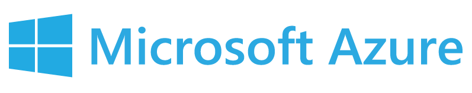
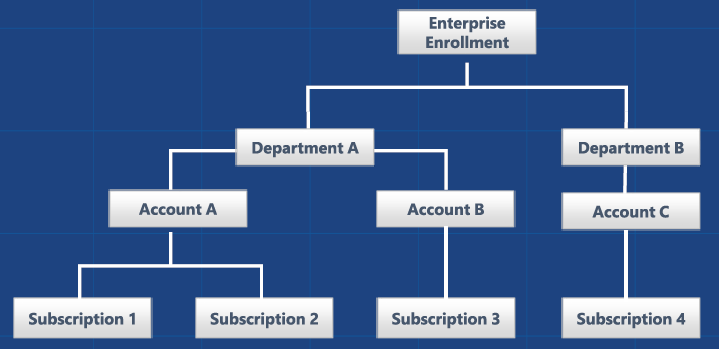

# Microsoft Azure Best practices



## Index

* [Introduction](#introduction)
* [Subscription Management](#subscription-management)
* [User Management](#user-management)
* [Storage](#storage)
* [Security](#security)
* [Monitoring](#monitoring)
* [Services](#services)
	* [Virtual Machines](#virtual-machines)
    * [SQL Database](#sql-database)
	* [DocumentDB](#documentdb)
    * [Scaling](#scaling)
	* [App Services](#app-services)

---
## Introduction

Microsoft Azure is the **Microsoft's Cloud Computing platform**. It provides many IaaS, PaaS and SaaS services that can be used to build complex infrastructures and deploy highly scalable applications.

Azure supports many different operating systems, programming languages, frameworks, tools, etc. as Windows, Linux, Docker containers, .NET, Java, PHP, Phyton, Node.js, etc. backends for iOS, Android and Windows devices, etc.

Currently, Microsoft Azure is by size the second cloud computing platform in the world, just after AWS and provides a similar services offer as AWS. This document only focus on the specific details and best practices of Azure cloud services. The general cloud best practices and cloud migration comments are very similar (just mapping the services names between AWS and Azure) to the ones described in the [AWS Best Practices](https://github.com/beeva/beeva-best-practices/blob/master/cloud/aws/README.md) page.

You can check here the service [mapping between AWS and Microsoft Azure](https://azure.microsoft.com/en-us/overview/azure-vs-aws/mapping/).

This document has the following sections:

- Subscription Management
- User Management
- Storage
- Security
- Monitoring
- Services

Please also note that the *Services* section is also splitted as follows:

- Virtual Machines
- SQL Database
- DocumentDB
- Scaling
- App Services

---

## Subscription Management

An **Azure Subscription** is a billing container where you can deploy Azure services. There is no written rule about how many subscriptions have to be created when a new project is launched. In BEEVA, we create a new Azure subscription per project and environment (development, maybe QA, staging and production).

BEEVA has signed an **Azure Enterprise Agreement** with Microsoft that simplifies the Azure subscription management. Microsoft provides a web portal for EA companies that allows to organize the subscriptions as a hierarchy and check easily the consumption and billing of any subscription at any moment.



In BEEVA, we organize the EA node hierarchy like this:
- Enterprise Enrollment: BEEVA
- Departments: Companies with which BEEVA collaborates. One of these nodes is named BEEVA and it is used to control our own internal Azure subscriptions.
- Accounts: One account node per project.
- Subscriptions: One Azure subscription per project and environment

Access to the EA portal is managed by our IT operations department at BEEVA. We create a not nominal account owner identity per account node (per project) with a name that follows the pattern:

```
<company>.<project>.azure@beeva.com
```

When a new account owner identity is created, a new corporate email alias with the same address is also created, and all the emails notifications are forwarded to *sistemas@beeva.com*.

---

## User Management

We control access to Azure subscriptions with **Azure Active Directory**. In BEEVA, we create a new user in the AAD for each BEEVA corporate user. We use as username the user corporate email address (*name.surname@beeva.com*).

External users, for example users from other companies that collaborates with BEEVA and need access to BEEVA Azure subscriptions, can be added to the BEEVA AAD tenant. User access to Azure resources is controlled, for external users, the same way as for corporate users. External users need to have a personal Microsoft Account, in order to be able to join BEEVA AAD tenant.

The minimum set of permissions rule apply when a new user is created. BEEVA operations team uses **Azure RBAC** (Role Base Access Control) to give users access to Azure Resources. A role is just a set of permissions and users get access to Azure resources when they are assigned to different roles. For example, a user can be assigned to the *virtual machines reader* role if the user only needs permission to read virtual machine data from a subscription.

In AAD we can create *Service Principal* identities. These type of identities can be used to authenticate applications and restrict their access to Azure resources with Azure RBAC, in the same way as we do with users. We never store user credentials in applications to log into AAD.

---

## Storage

*Azure Storage* is a cloud storage solution for modern applications that rely on durability, availability, and scalability. It is highly scalable, elastic, globally accessible, and automatically load-balances your data based on traffic.

### Replication options

*Azure Storage* has the following replication options:
- **Locally redundant storage (LRS)**: Locally redundant storage maintains three copies of your data. LRS is replicated three times within a single data center in a single region. LRS protects your data from normal hardware failures, but not from the failure of a single data center. Read access SLA: 99.9%
- **Zone-redundant storage (ZRS)**: Zone-redundant storage maintains three copies of your data. ZRS is replicated three times across two to three facilities, either within a single region or across two regions, providing higher durability than LRS. Read access SLA: 99.9%
- **Geo-redundant storage (GRS)**: GRS maintains six copies of your data. With GRS, your data is replicated three times within the primary region, and is also replicated three times in a secondary region hundreds of miles away from the primary region, providing the highest level of durability. Read access SLA: 99.9%
- **Read-access geo-redundant storage (RA-GRS)**: Read-access geo-redundant storage replicates your data to a secondary geographic location, and also provides read access to your data in the secondary location. Read-access geo-redundant storage allows you to access your data from either the primary or the secondary location, in the event that one location becomes unavailable. Read access SLA: 99.99%

### Storage services

*Azure Storage* provides the following services: *Blob Storage*, *Table Storage*, *Queue Storage* and *File Storage*.

#### Blob

*Blob Storage* offers a cost-effective solution to store large amounts of **unstructured object data** to store in the cloud. You can store content as documents, files, videos, images, app configuration data, etc.

Every blob is stored into a container. Containers also provide a useful way to assign security policies to groups of objects. A storage account can contain any number of containers, and a container can contain any number of blobs, up to the 500 TB capacity limit of the storage account.

If you do need to allow users controlled access to your storage resources, then you can create a *shared access signature*. A *shared access signature* (SAS) is a token that can be appended to a URL that enables delegated access to a storage resource. Anyone who possesses the token can access the resource it points to with the permissions it specifies, for the period of time that it is valid.

*Blob Storage* offers three types of blobs:
- **Block blobs**: Optimized for streaming and storing cloud objects, and are a good choice for storing documents, media files, backups etc.
- **Append blobs**: Similar to block blobs, but are optimized for append operations. An append blob can be updated only by adding a new block to the end. Append blobs are a good choice for scenarios such as logging, where new data needs to be written only to the end of the blob.
- **Page blobs (disks)**: Optimized for representing IaaS disks and supporting random writes, and may be up to 1 TB in size. An Azure virtual machine attached disk is a VHD file stored as a page blob.

Some *Blob Storage* limits to be aware of:
- Max size of a block or append blob: 195 GB
- Max size of a page blob: 1 TB
- Target throughput for single blob: Up to 60 MB per second, or up to 500 requests per second
- Max 8 KB IOPS per persistent disk (page blob): 500
- Max number of disks (page blobs) performing max IOPS: 40

As we can see, there is a limit of 500 IOPS per virtual machine disk, so in order to increase the IOPS of a VM, it is common to attach several disks to a VM and configure a Raid 0 device with them. We can increase the VM IOPS up to 20000. Usually, it is good enough to configure a Raid 0 device, because each *Storage Account* disk is high available and durable by itself.

#### Table

*Table Storage* is a **key-attribute store**, meaning that every value in a table is stored with a typed property name. The property name can be used for filtering and specifying selection criteria. A collection of properties and their values comprise an entity. Since *Table Storage* is schemaless, two entities in the same table can contain different collections of properties, and those properties can be of different types.

*Table Storage* offers highly available, massively scalable storage, so that your application can automatically scale to meet user demand. *Table Storage* is typically significantly lower in cost than traditional SQL for similar volumes of data.

*Table Storage* uses an auto-partitioning system that automatically load-balances your data based on traffic. 

Some *Table Storage* limits to be aware of:
- Max size of a table entity: 1 MB
- Max number of properties in a table entity: 252
- Target throughput for single table partition (1 KB entities): Up to 2000 messages per second

When working with *Table Storage* is important to choose good *partition* and *row keys* and batch operations when possible to improve performance.

#### Queue

*Queue Storage* provides a reliable messaging solution for **asynchronous communication** between application components.

A *Storage Account* can contain any number of queues and a queue can contain any number of messages, up to the capacity limit of the *Storage Account*.

Queues are essential to decouple components in order to build distributed applications. For example, we can build a web *front end*, to interact with users and store in a queue work to be done, and a *back end* to process asynchronously the work to be done from the queue. Note that we can scale out independently the *front* and the *back ends*.

Some *Queue Storage* limits to be aware of:
- Max size of a message in a queue: 64 KB
- Target throughput for single queue (1 KB messages): Up to 2000 messages per second

Some tips when working with queues:
-  Make the message process idempotent so it doesn’t get processed more than once.
-  Use the property *Dequeue Count* to distinguish poison messages.
-  If you need to work with messages bigger than 64 KB, stored the bulk of the message content in *Blob Storage* and add a link to it in the message sent to the queue.*

#### File

Azure *File Storage* offers cloud-based **SMB file shares**. With Azure *File Storage*, applications running in Azure virtual machines or cloud services can mount a file share in the cloud, just as a desktop application mounts a typical SMB share.

Distributed applications can also use *File Storage* to store and share useful application data and development and testing tools. For example, an application may store configuration files and diagnostic data such as logs, metrics, and crash dumps in a *File Storage* share so that they are available to multiple virtual machines.

Some *File Storage* limits to be aware of:
- Max size of a file share: 5 TB
- Max size of a file in a file share: 1 TB
- Target throughput for single file share: Up to 60 MB per second

### Storage access tiers

There are two types of access tiers that can be specified based on the data access pattern:
- **Hot** access tier: Objects in the storage account will be more frequently accessed. This allows you to store data at a lower access cost. This is the general purpose storage account type.
- **Cool** access tier: Objects in the storage account will be less frequently accessed. This allows you to store data at a lower data storage cost.

It is quite common to use *Cool Storage* to store logs from applications, audit data and backups in order to reduce the cost.

### Premium Storage

Azure *Premium Storage* delivers high-performance, low-latency disk support for virtual machines running I/O-intensive workloads. Virtual machine disks that use *Premium Storage* store data on **solid state drives** (SSDs).

An Azure VM supports attaching several *Premium Storage* disks, so that your applications can have up to 64 TB of storage per VM. With *Premium Storage*, your applications can achieve 80000 IOPS (input/output operations per second) per VM and 2000 MB per second disk throughput per VM with extremely low latencies for read operations.

It is important to note that a *Premium Storage* account only supports Locally Redundant Storage (LRS) and that you pay monthly for the whole disk and not for the size of the data stored in it, so it can be an expensive storage option.

Some *Premium Storage* limits to be aware of:
- Max disk size: 1 TB
- Max IOPS per disk: 5000
- Max throughput per disk: 200 MB per second

---
## Security

---
## Monitoring

---
## Services

### Virtual Machines

---
### SQL Database

---
### DocumentDB

---
### Scaling

---
### App Services

---
### References

* [Microsoft Azure](https://azure.microsoft.com/en-us/)
* [Azure Enterprise Agreement](https://azure.microsoft.com/en-us/pricing/enterprise-agreement/)
* [Azure Guidance](https://docs.microsoft.com/en-us/azure/guidance/)
* [Azure solution architectures](https://azure.microsoft.com/en-us/solutions/architecture/)
* [Best practices for running a Windows VM on Azure](https://docs.microsoft.com/en-us/azure/virtual-machines/virtual-machines-windows-guidance-compute-single-vm)
* [Best practices for Azure App Service](https://docs.microsoft.com/en-us/azure/app-service-web/app-service-best-practices)
* [Azure subscription and service limits, quotas, and constraints](https://docs.microsoft.com/en-us/azure/azure-subscription-service-limits)

___

[BEEVA](https://www.beeva.com) | Technology and innovative solutions for companies

