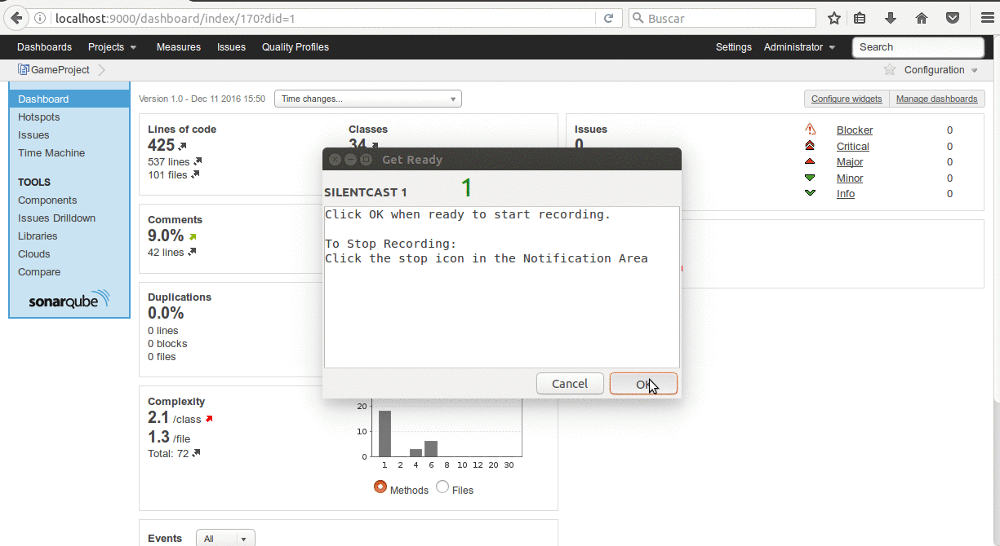

# Sonar Best Practices Guide

Sonarqube (previously called Sonar) is an open platform to manage code quality. Rules, alerts, thresholds, exclusions, settings... can be configured online. By leveraging its database, Sonar not only allows to combine metrics altogether but also to mix them with historical measures. Let’s see the rules I’ve selected through the compare profiles feature.

You can also reference the [official documentation](http://docs.sonarqube.org/display/SONAR/Documentation).

## Index

* [General SonarQube Technical Architecture](#general-sonarqube-technical-architecture)
* [Languages](#languages)
  * [Ruby](#ruby)
    * [Pending](#pending)
    * [Install Plugin](#install-plugin)
    * [Project structure](#project-structure)
    * [Analyze project](#analyze-project)
* [Sonar project templates](#sonar-project-templates)
* [References](#references)

## General SonarQube Technical Architecture

Generally, there is a "runner" that consumes the source code and analyzes it via plugins. This information is published to the SonarQube database directly. Before each run, the runner makes a call to the server to download configuration settings stored there, and mashes those with configuration settings stored in a local config file, as well as a project-specific config file.

The SonarQube (web) server pulls the results from the database and provides a UI for reviewing and managing them, as well as a UI for managing configuration settings, user authentication, etc. The server also has it's own config file where you define database settings, user authentication settings, etc.

You can read a ton more about SonarQube architecture in its [official manual](http://docs.sonarqube.org/display/SONAR/Architecture+and+Integration).

## Languages 

Plugins for some languages (C#, Java and, JavaScript) are bundled with the platform. To analyze a different language, install the plugin through the [update center](http://docs.sonarqube.org/display/SONAR/Update+Center) or via [direct download](http://docs.sonarqube.org/display/PLUG/Plugin+Library).

### Ruby

SonarQube for Ruby language need a plugin that it find in [other list of plugins](http://docs.sonarqube.org/display/PLUG/Other+Plugins) and Ruby SonarQube plugins that are not available in the Update Center.

[Ruby plugin](https://github.com/GoDaddy-Hosting/ruby-sonar-plugin) generate sonar metrics for ruby:
  * *Code Coverage*
  * *Code Complexity*

This plugin relies on well-known external tools: [SimpleCov](https://github.com/colszowka/simplecov), [SimpleCov-RCov](https://github.com/fguillen/simplecov-rcov) and [Metric_Fu](https://github.com/metricfu/metric_fu/)

#### Pending

Add support for the metrics:
  * *Code Duplication*
  * *Code Violations*

#### Install Plugin

_NOTE:_ This section guide covers exclusively this plugin for SonarQube version 3.7.3.

The latest version of plugin in branch master is compatibility for with Sonar 4.5.2 and up. So that we need compiling the plugin with the compatible version of SonarQube 3.7.3.

1. Move to previous commit in git repo:

  ```bash
  git checkout deec9c4029b200066044ae742a41cf957150bd52
  ```

2. Generate the JAR file:

  ```bash
  mvn package
  ```
  
3. Download the JAR file into the _$SONARQUBE_HOME/extensions/plugins directory_

#### Project structure

Each Solution will need to have it's own **sonar-project.properties** file. This file will need to exist in the folder from which you execute the sonar-runner. To make this easy, I would suggest putting the file in the same folder as your **Gemfile**.

The file will have a few sections, which I will describe here.

  * **Project Identification**
    This section will provide the project key used by the SonarQube server to group analysis results over time, as well as provide a useful name in the UI, etc. This should be unique across projects. The project version can be used to track different branches, etc.
  
    ```
    # Project identification
    sonar.projectKey=project:DemoApp
    sonar.projectVersion=trunk
    sonar.projectName=DemoApplication
    ```
    
    Additionally, you need to denote that the language is Ruby using the "ruby" value.
     
    ```
    # Info required for Sonar 
    sonar.sources=.
    sonar.tests=spec # optional and the folder can be 'spec' or 'test' due to testing framework used.
    sonar.language=ruby
    sonar.sourceEncoding=UTF-8
    ```
    
  * **Ruby plugin settings:**
    Here, you'll need to provide information about Code Coverage and Code Complexity 
    
    ```
    # Info required for Sonar 
    sonar.simplecovrcov.reportPath=coverage/.resultset.json
    sonar.metricfu.reportPath=tmp/metric_fu/report.yml
    ```
    
#### Analyze project

The SonarQube Runner is recommended as the default launcher to analyze a project with SonarQube. Get it from [here](http://docs.sonarqube.org/display/SONAR/Analyzing+Source+Code).

_NOTE:_ The SonarQube Runner is used the version 2.4.

First, we need run a ruby commands to generate metrics before to collect metrics for Sonar. Run the commands:

  ```bash
  $SONAR_RUNNER_HOME/bin/sonar-runner
  ```  

After, from the folder with the sonar-project.properties file, run the command 

  ```bash
  $SONAR_RUNNER_HOME/bin/sonar-runner
  ```  
After a successful run of the analysis, you can see the results in the SonarQube server webpage.

The report example will be for a Ruby on Rails project:
  
  
  
## Sonar project templates

There's a broad greater section of [Sonar Project Templates](templates/templates.md).

## References

* [Sonarqube Website](https://www.sonarqube.org/)

___

[BEEVA](http://www.beeva.com) | 2016


